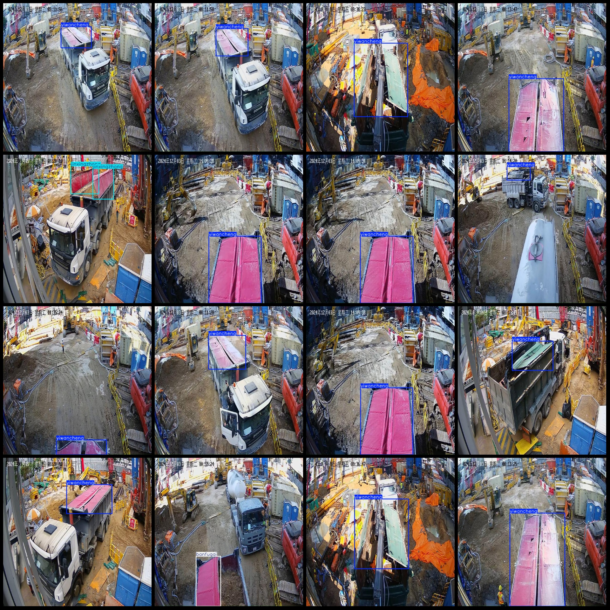
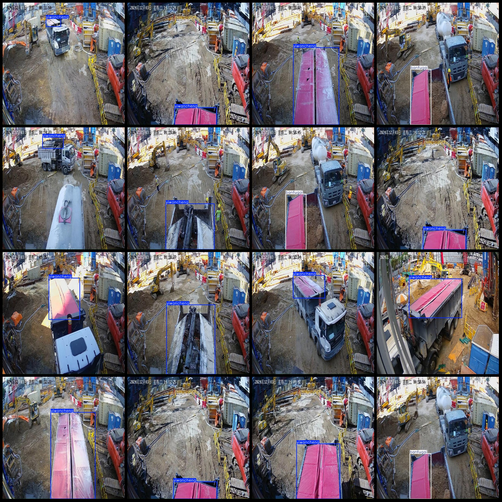

# Asphalt Truck Load State and Cap Coverage Detection Dataset in VOC+YOLO Format with 2000 Images in 3 Categories

Dataset format: Pascal VOC format + YOLO format (txt file without split path, only containing jpg images and corresponding VOC format xml files and YOLO format txt files)
Number of images (jpg file count): 2000
Number of annotations (xml file count): 2000
Number of annotations (txt file count): 2000
Number of annotation categories: 3
Annotation category names (note that the order of categories in the YOLO format does not correspond to this, but is based on the labels folder's classes.txt): ["banfugai", "jinxingzhong", 
"yiwancheng"]
[ "Half-covered", "In Progress", "Completed" ]
Number of bounding boxes for each category:
- banfugai: 250
- jinxingzhong: 252
- yiwancheng: 1610
Total bounding boxes: 2112
Number of images per category:
- banfugai: 250
- jinxingzhong: 180
- yiwancheng: 1602
Image resolution: 640x640
Used labeling tool: labelImg
Labeling rules: draw a rectangle around the category
Important note: The dataset does not have been divided into training, validation, or test sets; you need to divide them yourself.
Special declaration: This dataset does not guarantee the accuracy of the trained models or weight files.
Image preview:
## Images

Here is a pay link on Stripe ( https://buy.stripe.com/3cs8yP7sY87d0vu9AB ). Please contact me lonlonago@foxmail.com after funding $89, and I will send you a complete data files , thank you!

